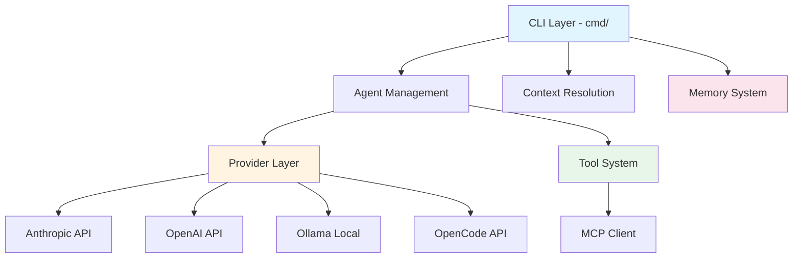
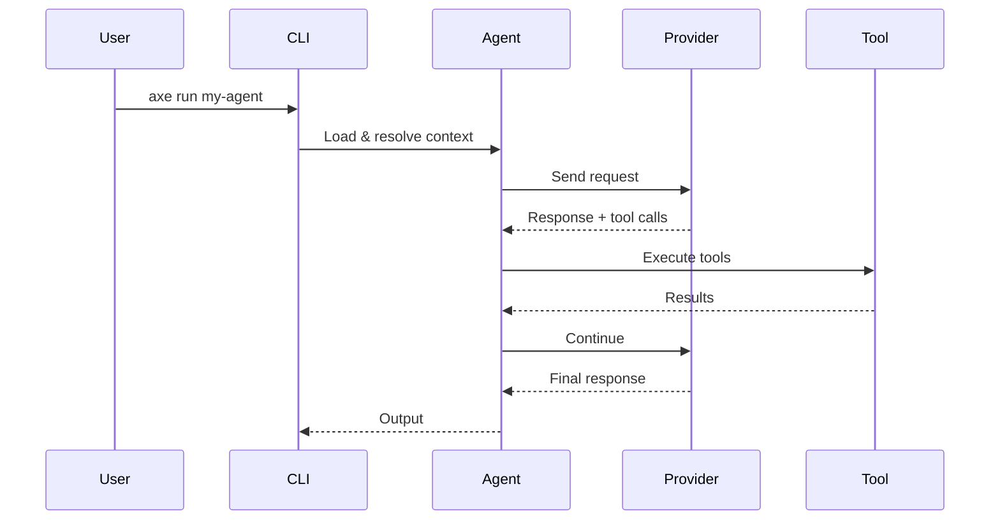

# System Architecture

## Overview

Axe follows a layered architecture with clear separation between CLI commands, business logic, and provider integrations. The design emphasizes composability, testability, and Unix philosophy principles.

## Architectural Diagram

## Core Layers

### CLI Layer (`cmd/`)
Entry point for all user interactions using Cobra framework.

**Commands:** run, agents (list/show/init/edit), config (init/path), gc, version

### Agent Management (`internal/agent/`)
Handles TOML configuration loading, validation, and agent lifecycle.

### Provider Layer (`internal/provider/`)
Abstracts LLM provider interactions with unified interface supporting Anthropic, OpenAI, Ollama, and OpenCode.

### Tool System (`internal/tool/`)
Built-in tools: list_directory, read_file, write_file, edit_file, run_command, url_fetch, web_search, call_agent.

**Security:** Path sandboxing, symlink escape prevention, working directory enforcement.

### Memory System (`internal/memory/`)
Persistent timestamped markdown entries with garbage collection.

### Context Resolution (`internal/resolve/`)
Resolves working directory, skill files, context files, and stdin with priority: flags > TOML > env vars > defaults.

### MCP Integration (`internal/mcpclient/`)
Model Context Protocol client for external tool integration via HTTP/stdio transports.

## Data Flow

## Design Principles

- **Unix Philosophy:** Single-purpose, composable, clean stdout
- **Context Minimization:** Small windows, opaque sub-agents
- **Configuration Over Code:** TOML-based, declarative
- **Testability:** Table-driven, minimal mocking
- **Security:** Path sandboxing, no arbitrary execution
