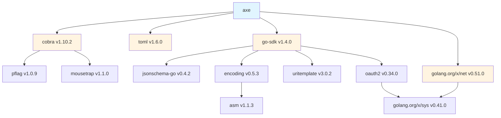

# Dependencies

## Direct Dependencies

### github.com/BurntSushi/toml (v1.6.0)
**Purpose:** TOML configuration file parsing  
**Used In:**
- `internal/agent/agent.go` - Parse agent TOML files
- `internal/config/config.go` - Parse global config.toml

**Why This Library:** Mature, well-tested TOML parser with good error messages

### github.com/spf13/cobra (v1.10.2)
**Purpose:** CLI framework  
**Used In:**
- `cmd/*.go` - All CLI commands and subcommands
- Command structure, flag parsing, help generation

**Why This Library:** Industry standard for Go CLI applications, excellent documentation

### github.com/modelcontextprotocol/go-sdk (v1.4.0)
**Purpose:** Model Context Protocol client implementation  
**Used In:**
- `internal/mcpclient/mcpclient.go` - MCP server communication
- Tool discovery and invocation

**Why This Library:** Official MCP SDK for Go

### golang.org/x/net (v0.51.0)
**Purpose:** HTTP/2 support and network utilities  
**Used In:**
- Provider HTTP clients
- MCP HTTP transport

**Why This Library:** Official Go extended networking library

## Indirect Dependencies

### github.com/google/jsonschema-go (v0.4.2)
**Purpose:** JSON Schema validation  
**Brought In By:** modelcontextprotocol/go-sdk  
**Used For:** MCP tool schema validation

### github.com/inconshreveable/mousetrap (v1.1.0)
**Purpose:** Windows console handling  
**Brought In By:** spf13/cobra  
**Used For:** Proper Windows console behavior

### github.com/segmentio/asm (v1.1.3)
**Purpose:** Assembly-optimized functions  
**Brought In By:** segmentio/encoding  
**Used For:** Performance optimization

### github.com/segmentio/encoding (v0.5.3)
**Purpose:** High-performance JSON encoding  
**Brought In By:** modelcontextprotocol/go-sdk  
**Used For:** Fast JSON serialization

### github.com/spf13/pflag (v1.0.9)
**Purpose:** POSIX/GNU-style flag parsing  
**Brought In By:** spf13/cobra  
**Used For:** Command-line flag handling

### github.com/yosida95/uritemplate/v3 (v3.0.2)
**Purpose:** URI template parsing (RFC 6570)  
**Brought In By:** modelcontextprotocol/go-sdk  
**Used For:** MCP URL template expansion

### golang.org/x/oauth2 (v0.34.0)
**Purpose:** OAuth2 authentication  
**Brought In By:** modelcontextprotocol/go-sdk  
**Used For:** MCP server authentication

### golang.org/x/sys (v0.41.0)
**Purpose:** System call interface  
**Brought In By:** Various dependencies  
**Used For:** Low-level OS operations

## Standard Library Usage

### Critical Standard Library Packages

**context**
- Request cancellation and timeouts
- Provider API calls
- Tool execution
- MCP communication

**encoding/json**
- Provider request/response serialization
- Tool argument parsing
- JSON output format
- MCP protocol

**net/http**
- Provider API clients
- MCP HTTP transport
- URL fetching
- Web search integration

**os/exec**
- `run_command` tool implementation
- MCP stdio transport
- Shell command execution

**path/filepath**
- Path resolution and validation
- Glob pattern matching
- Working directory handling
- XDG directory construction

**io/fs**
- File system operations
- Embedded skill files
- Directory traversal

**embed**
- Embed sample skill in binary
- `//go:embed skills/sample/SKILL.md`

**testing**
- All test files
- Table-driven tests
- Integration tests

## External Service Dependencies

### LLM Provider APIs

**Anthropic API**
- Endpoint: `https://api.anthropic.com`
- Authentication: `ANTHROPIC_API_KEY`
- Models: Claude family
- Used For: Primary LLM provider option

**OpenAI API**
- Endpoint: `https://api.openai.com`
- Authentication: `OPENAI_API_KEY`
- Models: GPT family
- Used For: Alternative LLM provider

**Ollama**
- Endpoint: `http://localhost:11434` (default)
- Authentication: None required
- Models: Local models
- Used For: Local/offline LLM execution

**OpenCode API**
- Endpoint: Configurable
- Authentication: API key
- Models: Claude, GPT, Gemini
- Used For: Multi-model provider

### Optional External Services

**Web Search API**
- Default: Brave Search API
- Endpoint: `https://api.search.brave.com/res/v1/web/search`
- Authentication: `AXE_WEB_SEARCH_API_KEY`
- Used For: `web_search` tool

**MCP Servers**
- User-configured external services
- Transports: HTTP, HTTPS, stdio
- Authentication: Per-server configuration
- Used For: Extended tool capabilities

## Build Dependencies

### Development Tools

**Go 1.25.0+**
- Required for building
- Uses Go modules for dependency management

**golangci-lint**
- Configuration: `.golangci.yml`
- Used For: Code linting and static analysis

**GoReleaser**
- Configuration: `.goreleaser.yml`
- Used For: Release automation and binary distribution

### CI/CD Dependencies

**GitHub Actions**
- Workflows: `.github/workflows/go.yml`, `.github/workflows/release.yml`
- Used For: Automated testing and releases

## Docker Dependencies

**Base Image:** `golang:1.25-alpine` (build stage)  
**Runtime Image:** `alpine:latest`

**Alpine Packages:**
- `ca-certificates` - HTTPS certificate validation
- `sh` - Shell for `run_command` tool

## Dependency Management Strategy

### Version Pinning
- All direct dependencies pinned to specific versions
- Indirect dependencies managed by Go modules
- Regular updates via `go get -u`

### Security Updates
- Monitor GitHub security advisories
- Update dependencies when vulnerabilities found
- Test thoroughly after updates

### Minimal Dependencies
- Only 3 direct dependencies (excluding stdlib extensions)
- Avoid unnecessary transitive dependencies
- Prefer standard library when possible

### Compatibility
- Go 1.25.0+ required
- No OS-specific dependencies in core logic
- Cross-platform support (Linux, macOS, Windows)

## Dependency Graph

## License Compatibility

All dependencies use permissive licenses compatible with Apache-2.0:
- MIT License: cobra, toml, most indirect dependencies
- BSD License: golang.org/x packages
- Apache-2.0: go-sdk

No GPL or copyleft licenses in dependency tree.
