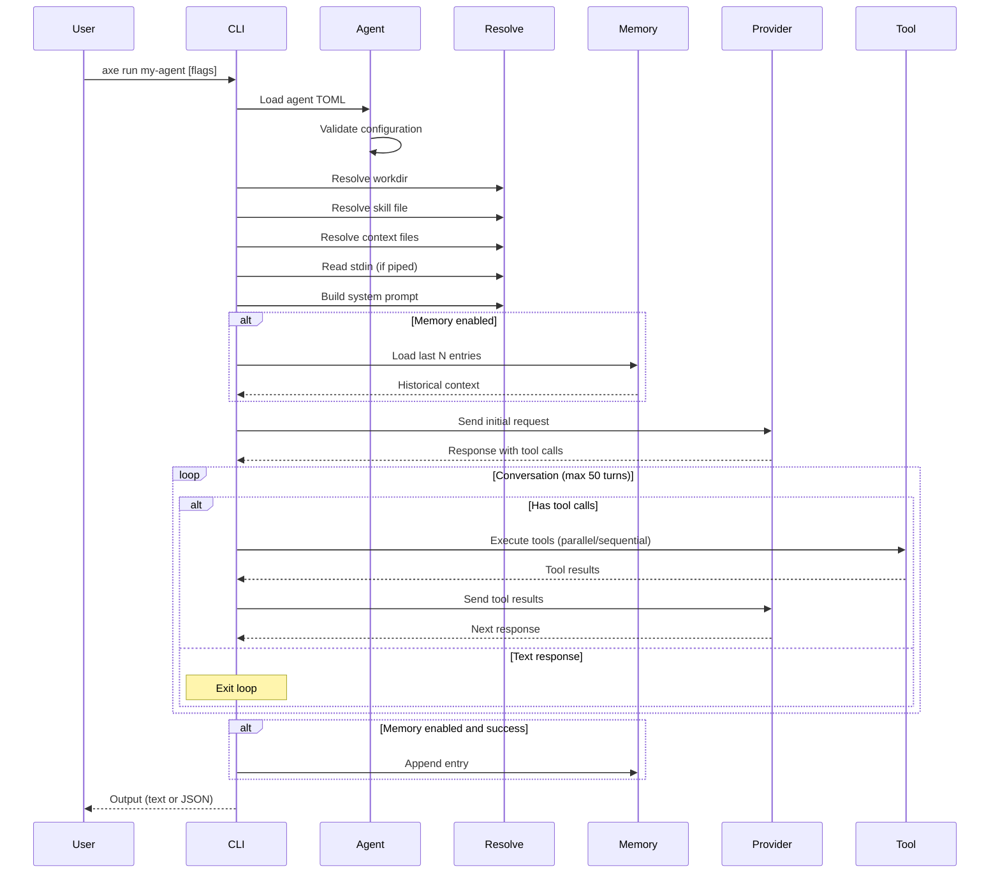
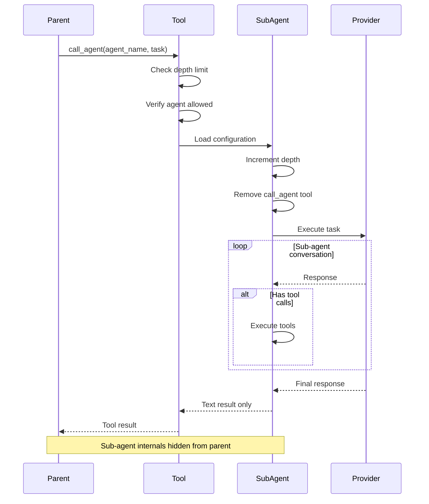
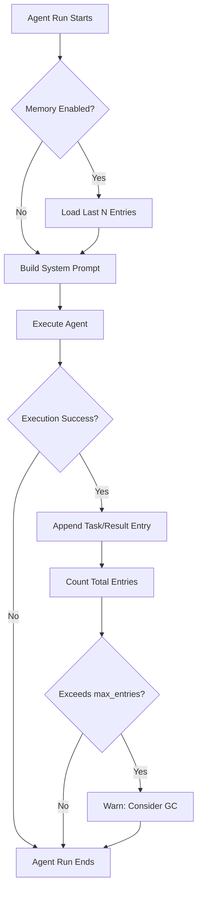
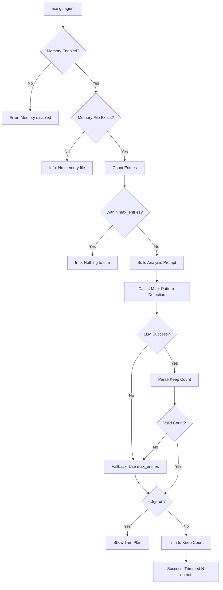
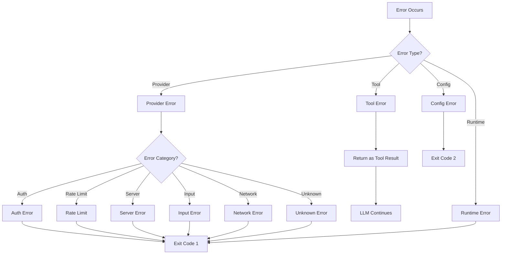

# Workflows

## Agent Execution Workflow



## Sub-Agent Delegation Workflow



## Memory Lifecycle Workflow



## Garbage Collection Workflow



## Tool Execution Workflow

```mermaid
flowchart TD
    Start[Receive Tool Calls]
    Parallel{Parallel Mode?}
    
    SeqLoop[For Each Tool Call]
    SeqDispatch[Dispatch Tool]
    SeqBuiltin{Built-in Tool?}
    SeqRegistry[Execute via Registry]
    SeqMCP[Execute via MCP Router]
    SeqResult[Collect Result]
    SeqNext{More Calls?}
    
    ParLoop[For Each Tool Call - Goroutine]
    ParDispatch[Dispatch Tool]
    ParBuiltin{Built-in Tool?}
    ParRegistry[Execute via Registry]
    ParMCP[Execute via MCP Router]
    ParResult[Collect Result]
    ParWait[Wait All Goroutines]
    
    Combine[Combine Results]
    Return[Return to LLM]
    
    Start --> Parallel
    
    Parallel -->|No| SeqLoop
    SeqLoop --> SeqDispatch
    SeqDispatch --> SeqBuiltin
    SeqBuiltin -->|Yes| SeqRegistry
    SeqBuiltin -->|No| SeqMCP
    SeqRegistry --> SeqResult
    SeqMCP --> SeqResult
    SeqResult --> SeqNext
    SeqNext -->|Yes| SeqLoop
    SeqNext -->|No| Combine
    
    Parallel -->|Yes| ParLoop
    ParLoop --> ParDispatch
    ParDispatch --> ParBuiltin
    ParBuiltin -->|Yes| ParRegistry
    ParBuiltin -->|No| ParMCP
    ParRegistry --> ParResult
    ParMCP --> ParResult
    ParResult --> ParWait
    ParWait --> Combine
    
    Combine --> Return
```



## Configuration Resolution Workflow

```mermaid
flowchart TD
    Start[Load Agent TOML]
    
    Model[Resolve Model]
    ModelFlag{--model flag?}
    ModelTOML[Use TOML model]
    ModelFinal[Final: model]
    
    Workdir[Resolve Workdir]
    WorkdirFlag{--workdir flag?}
    WorkdirTOML{TOML workdir?}
    WorkdirCWD[Use CWD]
    WorkdirExpand[Expand ~ and $VAR]
    WorkdirFinal[Final: workdir]
    
    Skill[Resolve Skill]
    SkillFlag{--skill flag?}
    SkillTOML[Use TOML skill]
    SkillResolve[Resolve Path]
    SkillFinal[Final: skill content]
    
    Files[Resolve Files]
    FilesGlob[Match Glob Patterns]
    FilesFilter[Filter Binary Files]
    FilesSort[Sort & Deduplicate]
    FilesFinal[Final: file contents]
    
    Stdin[Resolve Stdin]
    StdinPiped{Stdin Piped?}
    StdinRead[Read Stdin]
    StdinSkip[Skip]
    StdinFinal[Final: stdin content]
    
    Combine[Build System Prompt]
    Done[Context Ready]
    
    Start --> Model
    Model --> ModelFlag
    ModelFlag -->|Yes| ModelFinal
    ModelFlag -->|No| ModelTOML
    ModelTOML --> ModelFinal
    
    ModelFinal --> Workdir
    Workdir --> WorkdirFlag
    WorkdirFlag -->|Yes| WorkdirExpand
    WorkdirFlag -->|No| WorkdirTOML
    WorkdirTOML -->|Yes| WorkdirExpand
    WorkdirTOML -->|No| WorkdirCWD
    WorkdirCWD --> WorkdirExpand
    WorkdirExpand --> WorkdirFinal
    
    WorkdirFinal --> Skill
    Skill --> SkillFlag
    SkillFlag -->|Yes| SkillResolve
    SkillFlag -->|No| SkillTOML
    SkillTOML --> SkillResolve
    SkillResolve --> SkillFinal
    
    SkillFinal --> Files
    Files --> FilesGlob
    FilesGlob --> FilesFilter
    FilesFilter --> FilesSort
    FilesSort --> FilesFinal
    
    FilesFinal --> Stdin
    Stdin --> StdinPiped
    StdinPiped -->|Yes| StdinRead
    StdinPiped -->|No| StdinSkip
    StdinRead --> StdinFinal
    StdinSkip --> StdinFinal
    
    StdinFinal --> Combine
    Combine --> Done
```



## MCP Server Connection Workflow

```mermaid
flowchart TD
    Start[Load Agent Config]
    HasMCP{Has MCP Servers?}
    Skip[Skip MCP Setup]
    
    Loop[For Each MCP Server]
    CheckTransport{Transport Type?}
    
    Stdio[Stdio Transport]
    StdioCmd[Start Command Process]
    StdioConnect[Connect via Stdin/Stdout]
    
    HTTP[HTTP/HTTPS Transport]
    HTTPExpand[Expand ${VAR} in Headers]
    HTTPConnect[Create HTTP Client]
    
    ListTools[List Available Tools]
    RegisterTools[Register in Router]
    
    Next{More Servers?}
    Ready[MCP Ready]
    
    Start --> HasMCP
    HasMCP -->|No| Skip
    HasMCP -->|Yes| Loop
    
    Loop --> CheckTransport
    CheckTransport -->|stdio| Stdio
    CheckTransport -->|http/https| HTTP
    
    Stdio --> StdioCmd
    StdioCmd --> StdioConnect
    StdioConnect --> ListTools
    
    HTTP --> HTTPExpand
    HTTPExpand --> HTTPConnect
    HTTPConnect --> ListTools
    
    ListTools --> RegisterTools
    RegisterTools --> Next
    Next -->|Yes| Loop
    Next -->|No| Ready
```

## Error Handling Workflow



## Development Workflow

### Adding a New Tool

1. Create tool file in `internal/tool/`
2. Define tool entry function returning `Definition` and `Executor`
3. Implement executor function with `ExecuteContext` and arguments
4. Add constant to `internal/toolname/toolname.go`
5. Register in `internal/tool/registry.go` `RegisterAll()`
6. Add validation to `internal/toolname/ValidNames()`
7. Write unit tests in `*_test.go`
8. Add integration test in `cmd/run_integration_test.go`
9. Update documentation

### Adding a New Provider

1. Create provider file in `internal/provider/`
2. Implement `Provider` interface with `Send()` method
3. Implement request/response conversion functions
4. Implement error handling and categorization
5. Add constructor function (e.g., `NewProvider()`)
6. Register in `internal/provider/registry.go` `New()`
7. Add to `Supported()` function
8. Write unit tests with mock HTTP server
9. Add integration test in `cmd/run_integration_test.go`
10. Update documentation

### Adding a New Command

1. Create command file in `cmd/`
2. Define Cobra command with flags
3. Implement command logic
4. Add to root command in `init()` function
5. Write unit tests
6. Add smoke test in `cmd/smoke_test.go`
7. Create golden files if applicable
8. Update CLI documentation

### Release Workflow

1. Update `CHANGELOG.md` with changes
2. Update version in `cmd/version.go`
3. Commit changes
4. Create git tag: `git tag v1.x.x`
5. Push tag: `git push origin v1.x.x`
6. GitHub Actions runs GoReleaser
7. Binaries published to GitHub Releases
8. Docker images built and pushed (if configured)
